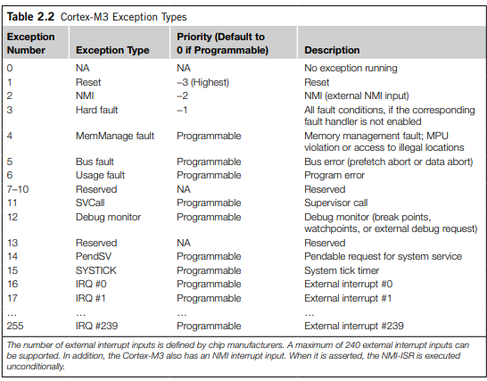

**Interrupts Table from M3 Guide**




**MISRA Rule 2.4 (advisory): Sections of code should not be “commented out”.**


Where it is required for sections of source code not to be compiled then this should be achieved by
use of conditional compilation (e.g. #if or #ifdef constructs with a comment). Using start and end
comment markers for this purpose is dangerous because C does not support nested comments, and
any comments already existing in the section of code would change the effect.

