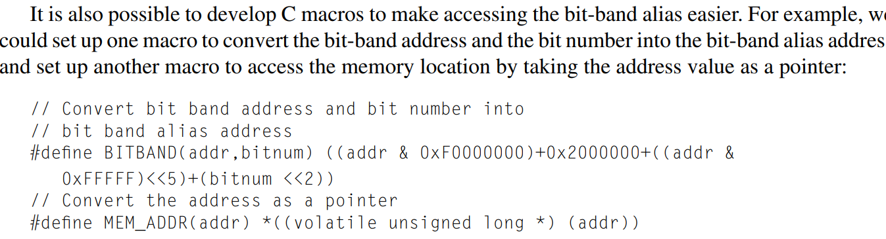
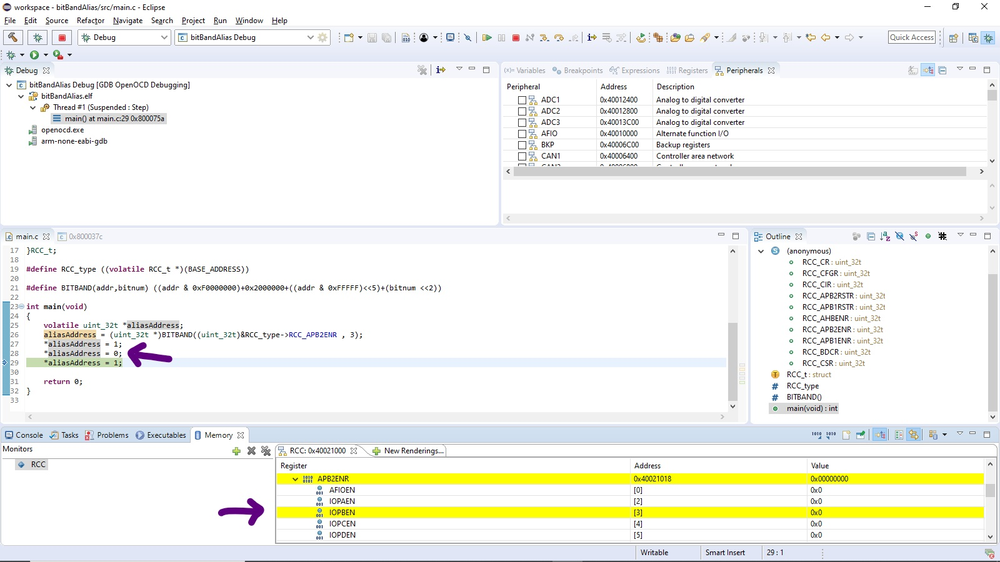
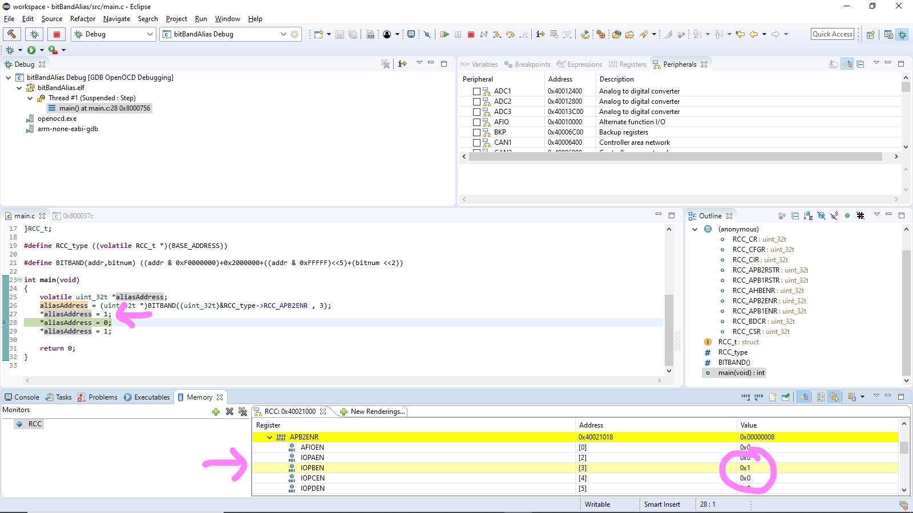

**BITBandAlias in ARM Cortex M3**

1-First open main.c and implement the macro function in M3 Guide as follow to make BitBandAlias 



2-There are two cases by changing the bit 3 in register RCC_APB2ENR as follow 








