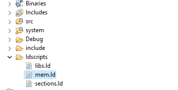
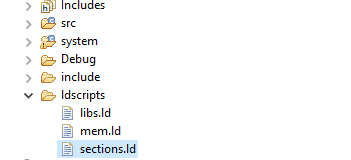
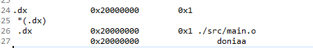

**Project Description**

This project aims to make memory section specified to only one variable to be
saved every time in the same place in memory

**Steps**

1.  First we need to make specific memory in mem.Id file as shown : DONIA (xrw)
    : ORIGIN = 0x20000000, LENGTH = 4

>   C:\\Users\\DELL\\Pictures\\Screenshots\\Screenshot (451).png

1.  Then we need to make specific section in section.Id as shown :

.dx : ALIGN(4)

{

>   KEEP(\*(.dx)) /\* donia part \*/

} \>DONIA

1.  Then we need to set compiler instruction as shown :

>   **\_attribute\_** ((section(".*dx*"),used))uint8_t doniaa;

1.  Then check the file .map after compiling to make sure that variable in
    memory Donia for Example :

>   C:\\Users\\DELL\\Pictures\\Screenshots\\Screenshot (455).png

>   K:\\ALL_ITI_DATA\\3dad55b6-101e-4e13-a02b-0540e8082a61_200x200.png
