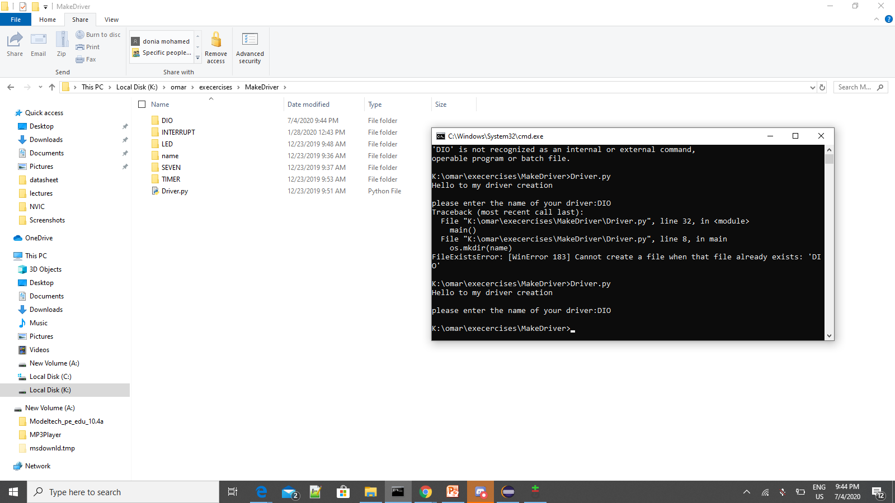
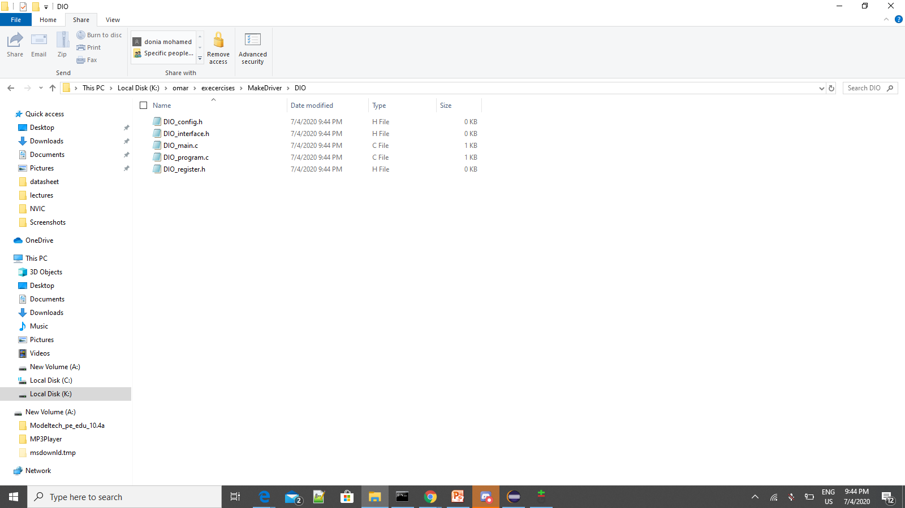
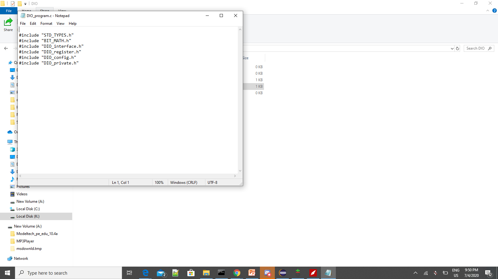

**DriverFiles creation**

1- First we will open Cmd and run Driver,py 
2-Then the file will open and ask you to add the driver name that you needed to be created
3-Then folder will be created as follow
 


4-Then open the folder and you will find all files created as follow



5-If you open any file you will find all includes have been attached as follow 



6-You can add extra features to add guards to header file or any other feature 
